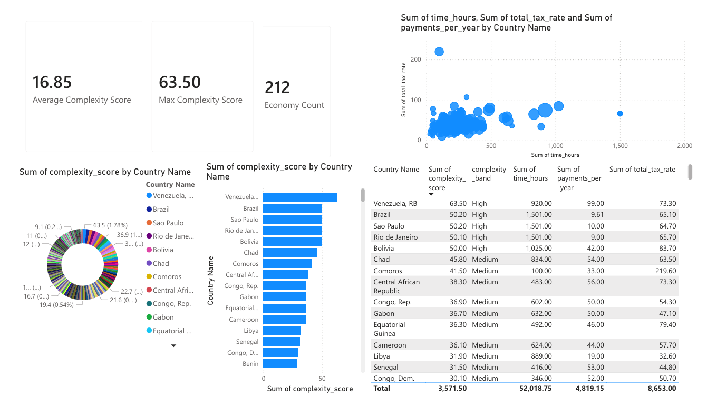

# International Tax Administration Complexity Dashboard

A data analytics project that compares tax compliance burden across international economies using World Bank Doing Business **Paying Taxes** indicators.

This project uses **Python**, **pandas**, and **Power BI** to clean, merge, score, and visualize public tax administration data. The final output is a comparative dashboard that highlights where tax compliance appears most administratively burdensome based on time, payment frequency, and overall tax burden.

## Dashboard Preview



> Replace `dashboard_preview.png` with the actual name of your uploaded screenshot.  
> If your image is in the root folder instead of an `images/` folder, use:
>
> ```markdown
> 
> ```

## Project Overview

The goal of this project is to build a transparent and practical analytics workflow for comparing tax administration complexity across economies.

Using public World Bank Doing Business data, this project combines three key indicators:

- **Paying taxes: Time (hours per year)**
- **Paying taxes: Payments (number per year)**
- **Paying taxes: Total tax and contribution rate (% of profit)**

These indicators are cleaned and normalized in Python, then used to create a custom **Tax Complexity Score**. The results are exported into a Power BI dashboard for comparison, ranking, and visual analysis.

## Problem Statement

Tax compliance burden can vary significantly across jurisdictions. Businesses may spend more time preparing and paying taxes, make more payments per year, or face a higher total tax burden depending on the economy.

This project answers the question:

**Which economies in the dataset appear to have the most complex tax administration burden based on public World Bank indicators?**

## Objectives

- Clean and prepare public international tax indicator data
- Merge multiple World Bank series into a single analytical dataset
- Build a transparent weighted complexity score
- Classify economies into complexity bands
- Visualize results in Power BI for stakeholder-friendly analysis

## Dataset

Source: **World Bank Doing Business – Paying Taxes**

Indicators used:

- `PAY.TAX.TM` — Paying taxes: Time (hours per year)
- `PAY.TAX.PYMT.FREQ.NO` — Paying taxes: Payments (number per year)
- `PAY.TAX.TOT.TAX.RT.ZS` — Paying taxes: Total tax and contribution rate (% of profit)

## Methodology

### 1. Data Collection
Three separate CSV files were downloaded from the World Bank DataBank portal for the selected tax indicators.

### 2. Data Cleaning
Using Python and pandas:
- relevant columns were selected
- the latest available year was extracted
- numeric values were converted and cleaned
- missing rows were removed

### 3. Feature Engineering
Each metric was normalized using min-max scaling to create comparable 0–100 sub-scores:
- `time_score`
- `payments_score`
- `tax_rate_score`

### 4. Complexity Score
A weighted composite score was created:

- **40%** Time burden
- **30%** Payment frequency
- **30%** Total tax burden

Formula:

```python
complexity_score = 0.40 * time_score + 0.30 * payments_score + 0.30 * tax_rate_score
